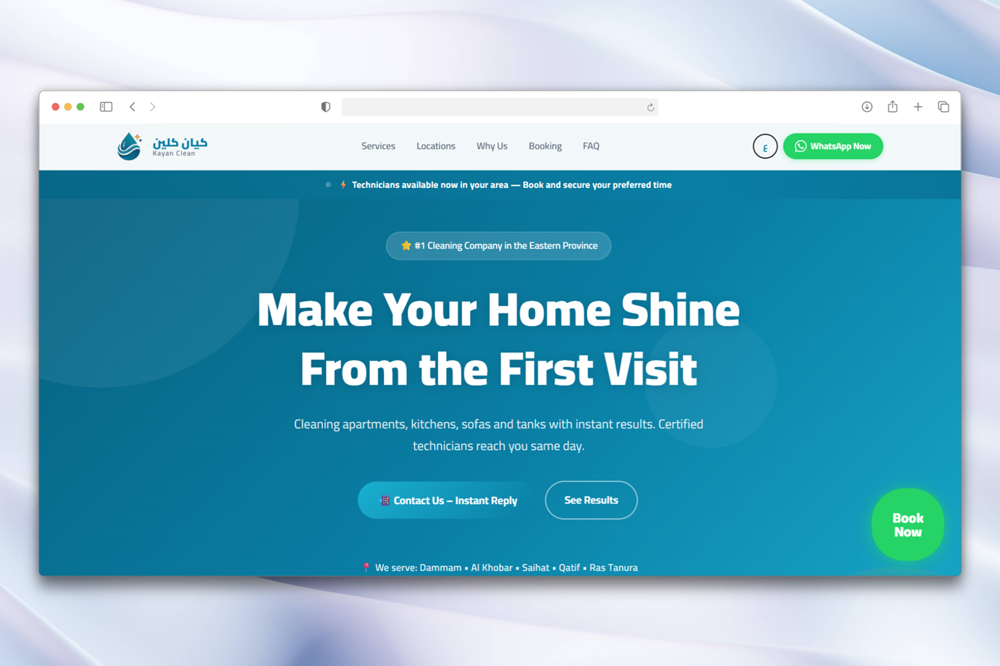
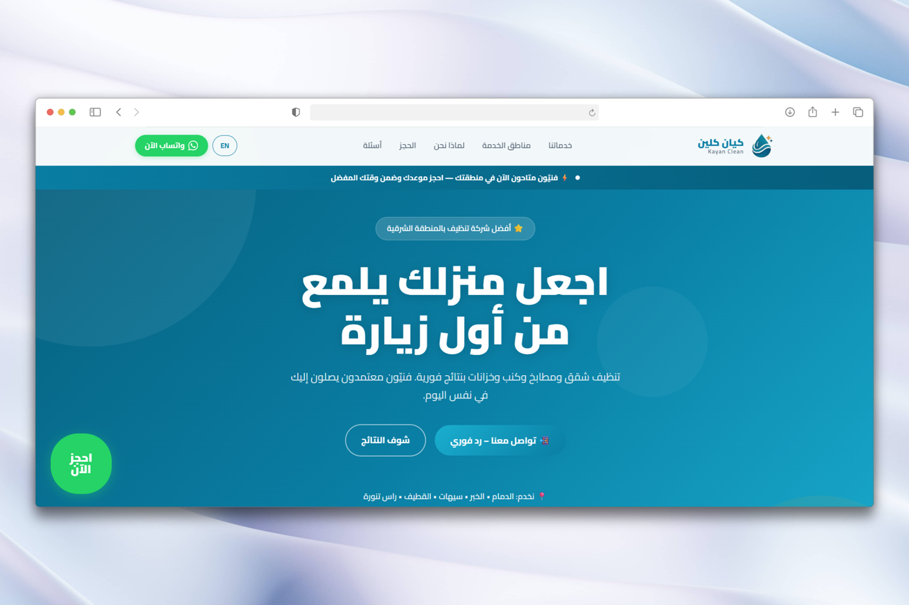
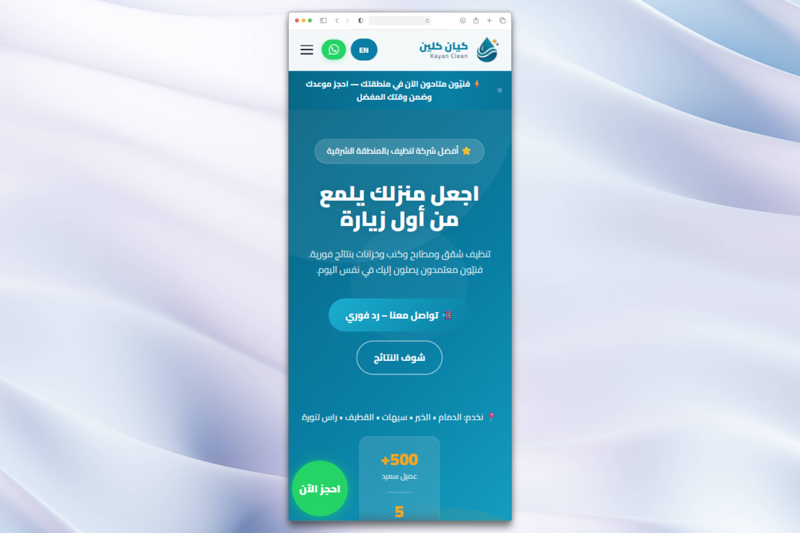

# Kayan Clean – Digital Platform

## Overview
This project was built for a cleaning services company in Saudi Arabia, focusing on brand presence and lead generation.

## Scope
- Website development  
- Brand identity  
- Paid campaigns (Meta, TikTok)

## Approach
Built as a single flow: traffic → website → direct conversion (WhatsApp).

## Website

- Responsive design  
- Arabic / English (RTL support)  
- Conversion-focused UI  
- Fast loading frontend  

## Stack
- HTML, CSS, JavaScript  
